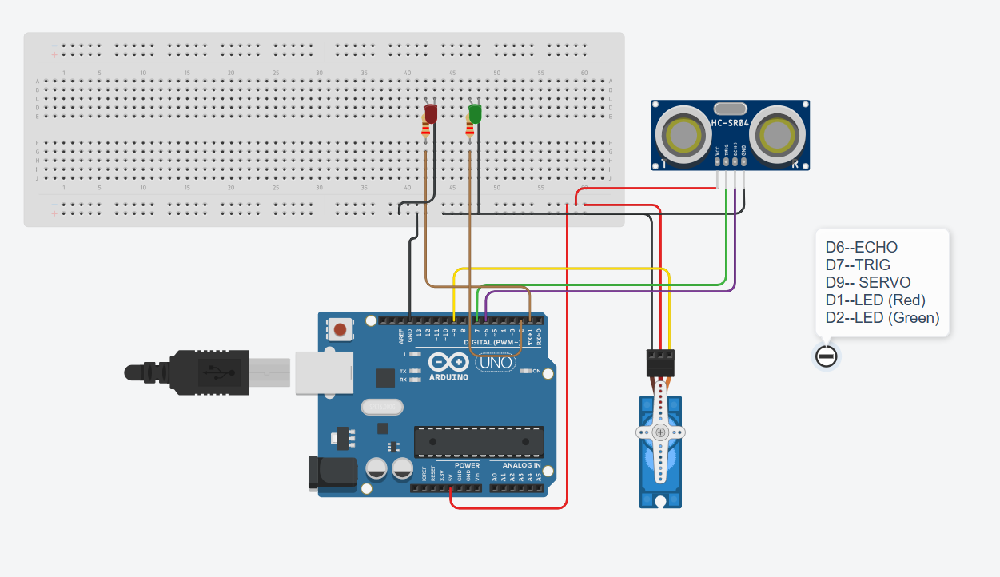

# 🚮 Arduino Smart Dustbin

An automatic dustbin system built using Arduino, an ultrasonic sensor, and a servo motor. The lid detects a nearby object (like a hand) and opens automatically for a few seconds before closing again.

## ✨ Features

* Automatic lid opening using distance detection
* Ultrasonic sensing with HC-SR04
* Servo-controlled lid mechanism
* Green LED indicator when the lid is open
* Red LED indicator when idle
* Simple Arduino-based embedded system

## 🛠️ Components Used

* Arduino Uno
* HC-SR04 Ultrasonic Sensor
* Servo Motor (SG90 or similar)
* Red LED
* Green LED
* 220Ω resistors
* Breadboard
* Jumper wires

## 🔌 Circuit Connections

### HC-SR04

| Sensor Pin | Arduino Pin |
| ---------- | ----------- |
| VCC        | 5V          |
| GND        | GND         |
| TRIG       | D7          |
| ECHO       | D6          |

### Servo Motor

| Servo Wire | Arduino Pin |
| ---------- | ----------- |
| VCC        | 5V          |
| GND        | GND         |
| Signal     | D9          |

### LEDs

| LED   | Arduino Pin |
| ----- | ----------- |
| Red   | D1          |
| Green | D2          |

## 📚 What I Learned

* How ultrasonic sensors (HC-SR04) work and measure distance using sound waves
* How to read sensor data using Arduino
* How to control a servo motor with the Servo library
* Using LEDs as status indicators

* Sensor input → Processing → Output action
* Writing Arduino code using conditions and logic
* Basics of building and testing a real-world automation project

## 🔌 Wiring Diagram

